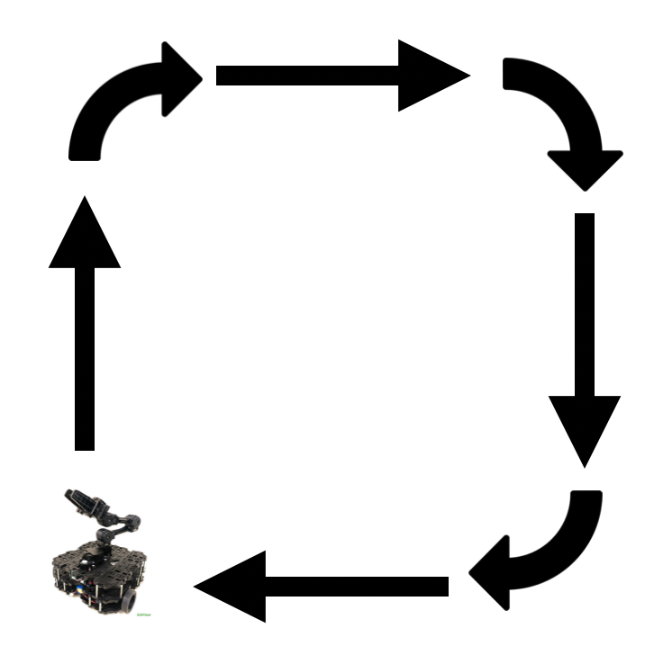

# warmup_project

## Robot Behavior

### Driving in a Square
* High-level Description

  The task is to drive the robot in a square, so I wrote my code to drive the robot in a square clockwise. The robot would first move forward, then turn right 90 degrees. These two actions would be completed by the robot for 4 times (see the following graph). By the time that the robot drives in a square, the robot will stop at its initial location. 
 
  

* Code explanation

  I created a node called DriveSquare(), which drives the robot in a square clockwise. In the node, I initialized the ROS node and set up a publisher for the cmd_vel ROS topic. Then, I defined the run function and set up three kinds of the Twist messages: move forward, turn right 90 degrees, and stop. To drive the robot in a square, I published the messages with one-second intervals and let the robot move forward and turn right (each for 4 times) and stop at the end.

* Gif 

  

### Person Follower
In progress.

### Wall Follower
In progress. 

## Challenges: 
* Computer Setup: I encountered many challenges using Virtual Box VM to control the robot. I would experience sudden extreme lags every hour and would be forced to send the shutdown signal to the VM. causing my temporary work not to be saved. Thanks to Colin, I am now able to use Virtual Box VM without experiencing extreme lags. Also thanks to David (TA), I am able to type even faster on the VM after adopting his tip in setting Virtual Box to low resolution mode.

## Future work: 

If you had more time, how would you improve your robot behaviors?
## Takeaways (at least 2 bullet points with a few sentences per bullet point): 
* 
What are your key takeaways from this project that would help you/others in future robot programming assignments? For each takeaway, provide a few sentences of elaboration.
